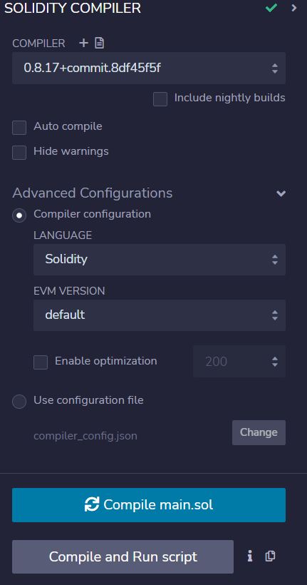
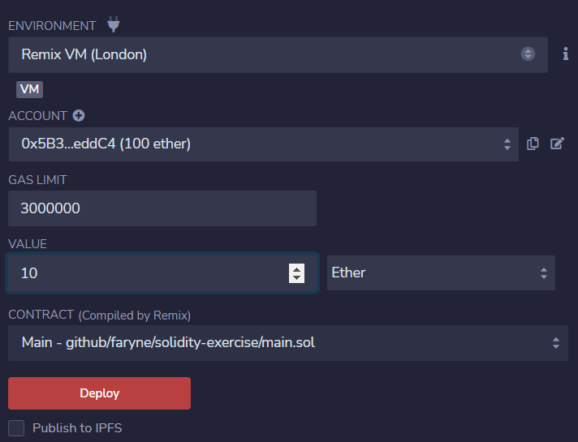
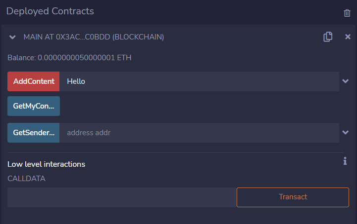

# 關於本合約

本合約係參考 [solidity.org](https://docs.soliditylang.org/en/v0.8.17/) 官方文件及其他相關教學文件初步撰寫出來的實驗合約內容。

在執行過程中需要以下項目：
* [Remix](https://remix.ethereum.org/)：可於線上使用的 Solidity IDE，集撰寫、測試及部署等功能於一身。
* [Solidity官方文件](https://docs.soliditylang.org/en/v0.8.17/)：本合約使用 Solidity 0.8.17 標準撰寫，因此使用的參考文件以該版本為主。

本合約內容主要放置在 `main.sol` 檔案內。可以直接打開閱覽。

## 逐行說明
---
在第一行會看到以下內容：
```solidity
// SPDX-License-Identifier: MIT
```
該行註解宣告合約的授權方式，一律都是 `// SPDX-License-Identifier: ` 開頭加上授權方式（例如：`MIT` 或 `BSD` ）。
以本合約為例，這代表本合約採取 `MIT` 授權方式，可以修改後任意使用，只需標明 MIT 授權條款及相關著作權聲明即可。

若是不想公開的合約，則需要宣告為 `Unlicense`。

更詳盡的授權列表，可以參見[此處](https://spdx.org/licenses/)。

---
第二行：
```solidity
pragma solidity ^0.8.17;
```

`pragma` 關鍵字代表要引用什麼項目，一開始只會引用到 `Solidity`，因此第二個單字就會是 `solidity`。

第三個關鍵字中的 `^0.8.17` ，代表要使用 `0.8.17` 以上版本，其中的 `^` 代表的就是以上。因此只要出了更新的版本，例如 `0.8.18`，在編譯發佈時則會引用 `0.8.18` 版本處理。但這麼寫可能會有意料外的風險，需要注意。


若是要固定在某個版本，則可以寫成像是 `0.8.17` 這樣，無論如何就只會引用 `0.8.17` 處理。

關於 Solidity 版本號列表，可以在[此頁](https://github.com/ethereum/solc-bin/blob/gh-pages/bin/list.txt)找到。

---
第三行開始即為合約的主體內容，主要格式如下：
```solidity
contract [合約名稱] {
    // 內容
}
```

這裡類似其他程式語言中的 `class` 宣告，因此有程式語言概念的話，大可以把 `contract` 想成一個 class，裡面會有各種方法可供呼叫或做其他處理。

一個 `sol` 檔中可以有多個 contract 宣告，也可以在不同的 `sol` 檔宣告不同的 contract ，並透過 `import` 將該 contract 引入使用。

但以初學的角度來看，目前就只會有一個 sol 檔放置一個合約內容。

---
以下先列出目前這份合約所擁有的方法及屬性：

屬性：

```solidity
// 建立一組名稱為 messages ，以位址（`address`）為 key 的 map
// 其中的 `mapping`、`address` 及 `string` 都是 Solidity 的資料類型
// 此變數在此合約內有效，且無法直接被碰觸到
mapping(address => string) private messages
```

```solidity
// 用於存放要求者的 address 資訊，例如 0x........
address private requester
```

方法：
```solidity
// 建構子，會在合約開始時就執行
// 括號後面加上的 payable ，是為了存取此次要求執行合約者的資訊
// 如果不加的話將會無法存取到該資訊。
// 這裡面只將存取此份合約者的錢包位址存放在 requester 這個屬性成員之中。
constructor() payable
```

```solidity
// 定義這份合約收取費用的方法，
// 如果沒實作內容的話基本上就只是把存取這份合約者送來的錢加到這份合約的錢包內。
// 通常會在這裡定義收到錢後，要做些什麼事。
receive() external payable
```

```solidity
// 定義當 receive 時執行失敗時所需要做的事情
// 基本上當 receive 失敗後，全部狀態都會被復原。除非有額外需求才要實作其內容
fallback() external payable
```

```solidity
// 將傳入的字串內容放進前面宣告的 messages 內
// 這裡使用 memory 存放，可以減少 Gas Fee 的花費
function AddContent(string memory content) public payable
```

```solidity
// 傳入 address 位址後，從 messages 內取出該 address 內存放的文字內容
function GetSenderContent(address addr) public view returns (string memory)
```

```solidity
// 傳出要求合約執行者所存放的文字
function GetMyContent() public view returns (string memory)
```

## 部署及測試
* 打開 Remix 在首頁點擊 `New File`，左手邊的檔案列表中會提示輸入檔名。檔名輸入完後，就會開啟編輯畫面。

* 將這個 repository 中的 `main.sol` 檔貼到編輯畫面中。

* 點擊畫面左手邊工具列中的 `Solidity compiler`，再點擊裡面的 `Compile main.sol` 按鍵開始編譯。若是發生錯誤，其下方會出現相關錯誤訊息可供參考除錯用。

|  |
|:--:|
| 圖一 |

* 如果編譯沒有問題的話，可以點擊畫面左手邊工具列中的 `Deploy & run transactions`，將該合約部署上測試鏈。

|  |
|:--:|
| 圖二 |

>  `Environment` 可以選擇 `Remix VM` ，每天都會有 100 個 ETH 可以供測試部署使用。這 100 個 ETH 除了拿來測試部署外，也能作為呼叫合約的費用。當然也可以選擇連結自己的 MetaMask 錢包，那麼該次部署費用就是直接從錢包扣。在實驗過程中我最高被扣了 0.08 個 GoerliETH！

> 在部署時如果 `Value` 填入大於 0 的值時，部署時會一併轉入 `Value` 單位的錢進去，以上圖為例，這會先轉入 10ETH 到該合約內。 

* 部署成功後，下方的 `Deployed Contracts`，並且出現可供呼叫的方法。

|  |
|:--:|
| 圖三 |

> 到此步驟時可以在圖二中的 Value 填入要發出去的錢數值，然後按下圖三中的 `Transact` 執行交易。成功的話，`Balance` 的值即會增加。

> 也可以在上面各方法的輸入框輸入相應的參數後，並重複上述步驟，即會執行該方法，並觀察到 `Balance` 的增加。

## 成果
* 合約位址：[0x3Ac20ec16E74B19989fB9dCa4cd8f98B5C4c0bDD](https://goerli.etherscan.io/address/0x3ac20ec16e74b19989fb9dca4cd8f98b5c4c0bdd#code)
* 測試時使用的錢包位址：[0x6e18EC2321bc0CF77949C89475EA22ECE63567c8](https://goerli.etherscan.io/address/0x6e18EC2321bc0CF77949C89475EA22ECE63567c8)

